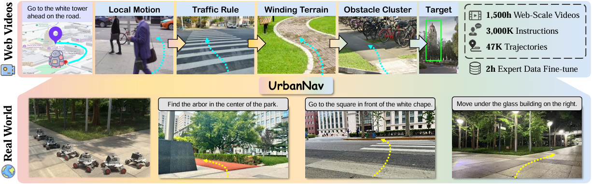

<br>
<p align="center">

<h1 align="center"><strong>UrbanNav: Learning Language-Guided Urban Navigation from Web-Scale Human Trajectories</strong></h1>
  <p align="center"><span><a href=""></a></span>
              <a>Yanghong Mei<sup>*1,5</sup>,</a>
              <a>Yirong Yang<sup>*2</sup>,</a>
              <a>Longteng Guo<sup>†1</sup>,</a>
              <a>Qunbo Wang<sup>3</sup>,</a>
              <a>Ming-Ming Yu<sup>2</sup>,</a> <br>
              <a>Xingjian He<sup>1</sup>,</a>
              <a>Wenjun Wu<sup>2,4</sup>,</a>
              <a>Jing Liu<sup>1,5</sup>,</a>
    <br>
    <sup>1</sup>Institute of Automation, Chinese Academy of Sciences <br>
    <sup>2</sup>Beihang University <br>
    <sup>3</sup>Beijing Jiaotong University <br> 
    <sup>4</sup>Hangzhou International Innovation Institute <br>
    <sup>5</sup>School of Artificial Intelligence, University of Chinese Academy of Sciences
    <br>
  </p>
    
<p align="center">
  <a href="https://arxiv.org/abs/2512.09607" target="_blank">
    
  </a>&nbsp;&nbsp;
  <a href="https://github.com/Vigar0108M/UrbanNav" target="_blank">
    
  </a>&nbsp;&nbsp;
<a href="https://github.com/Vigar0108M/UrbanNav" target="_blank">
    
</a>
</p>


## 📢 News
- **[12/19/2025]:** UrbanNav dataset is now available! Check out our dataset on [Hugging Face](https://huggingface.co/datasets/Vigar001/UrbanNav) for more details.

## 👋 Introduction
**UrbanNav** is a large-scale urban navigation dataset automatically constructed using Qwen2.5-VL based on web data, comprising 47k trajectories and 3M language instructions.  designed for training language-guided embodied urban navigation and enabling fair offline evaluation. Our navigation policy trained on UrbanNav achieves state-of-the-art performance both on the benchmark and in real-world deployment.




## 🚗 Demo
UrbanNav navigation policy is deployed on a four-wheel differential-drive robot and validated in challenging and diverse outdoor urban environments.


## ⚙️ Installation
```
conda create -n urbannav python=3.10
conda activate urbannav
pip install -r requirements.txt
```

## 🗃️ UrbanNav Dataset
You can easily prepare the UrbanNav dataset by following the steps below:

#### 1. Download 
All YouTube video IDs used by UrbanNav are listed in the [video list](video_list.txt). You need to download these videos in 360p resolution at 30 FPS and place them in the same directory. 

The trajectory data and instruction annotations are publicly available on [Hugging Face](https://huggingface.co/datasets/Vigar001/UrbanNav). Please download `annos.tar.gz` and extract it:
```
wget https://huggingface.co/datasets/Vigar001/UrbanNav/resolve/main/annos.tar.gz
tar -xzf annos.tar.gz
```


#### 2. Split the videos.
Use `scripts/split_video_parallel.py` to split the raw videos into 120-second segments in parallel. After completion, the original videos can be safely deleted to save storage space.
```
python scripts/split_video_parallel.py \ 
    --video-dir /path/to/videos \
    --output-dir /path/to/video_clips \
    --workers 32
```

#### 3. Extract frames
Use `scripts/extract_video_frames.py` to extract images in parallel from each trajectory. UrbanNav uses an image frequency of 1 FPS; if your downloaded videos are recorded at 30 FPS, set `--stride 30` to align the extracted frames with our labels.
```
python scripts/extract_video_frames.py \
    --input_dir /path/to/video_clips \
    --output-dir /path/to/data_dir \
    --stride 30 \
    --workers 32
```

#### 4. Merge annotations
This is the final step in preparing the UrbanNav dataset! Run `scripts/merge_annotations.py` to copy annotation files into their corresponding trajectory folders. 
```
scripts/merge_annotations.py \
    --data-dir /path/to/data_dir \
    --anno-dir  /path/to/annotation_dir
```

After running the script, your data will have the following structure.


```
UrbanNav/data
├── <video_name_0000>
|   ├── 0000.jpg
|   ├── 0001.jpg
|   ├── ...
|   ├── T_1.jpg
|   ├── traj_data.pkl
|   └── label.json
├── <video_name_0001>
|   ├── 0000.jpg
|   ├── 0001.jpg
|   ├── ...
|   ├── T_2.jpg
|   ├── traj_data.pkl
|   └── label.json 
|   ...
└── <video_name_N>
    ├── 0000.jpg
    ├── 0001.jpg
    ├── ...
    ├── T_N.jpg
    ├── traj_data.pkl
    └── label.json 
```
**Note**: Approximately 50% of trajectories were filtered out due to missing annotation files; the filtered trajectories are listed in `filtered_trajs.txt` (generated by `scripts/merge_annotations.py`) and can be safely deleted to free up storage space.


## 🏋️ Training
### Quick start
For a quick start, use `launch/urbannav_train.sh` to train the navigation policy on the UrbanNav dataset.
```
bash launch/urbannav_train.sh
```
Or use `torchrun` to customize the training configuration: 
```
export CUDA_VISIBLE_DEVICES=0,1,2,3,4,5,6,7
export NUM_NODES=1
export CURR_NODE_RANK=0
export WORLD_SIZE=8

torchrun \
  --nnodes=${NUM_NODES} \
  --nproc-per-node=${WORLD_SIZE} \
  --node-rank=${CURR_NODE_RANK} \
  --rdzv-backend=c10d \
  --rdzv-endpoint=localhost:12333 \
  train.py --config configs/urbannav_train.yaml
```
You can also use a single GPU for debugging: 
```
python train.py -c configs/urbannav_debug.yaml
```

### Optional
We strongly recommend pre-extracting and caching the visual features before training. This significantly improves training efficiency and reduces GPU memory usage.

Use `scripts/extract_features_cache.py` to extract image features and save them in LMDB format: 
```
python scripts/extract_features_cache.py \
    --data-dir /path/to/data_dir \
    --cache_dir /path/to/cache_dir \
    --model-name <model_name> \
    --gpus 0 1 2 3 4 5 6 7
```
Then, update the `data/feat_file` parameter in `configs/urbannav_train.yaml` to point to your LMDB cache path, and you're ready to start efficient training.


## 🌟 Citation

If you find this repository or our paper useful, please consider **starring** this repository and **citing** our paper:
```bibtex
@misc{mei2025urbannavlearninglanguageguidedurban,
      title={UrbanNav: Learning Language-Guided Urban Navigation from Web-Scale Human Trajectories}, 
      author={Yanghong Mei and Yirong Yang and Longteng Guo and Qunbo Wang and Ming-Ming Yu and Xingjian He and Wenjun Wu and Jing Liu},
      year={2025},
      eprint={2512.09607},
      archivePrefix={arXiv},
      primaryClass={cs.RO},
      url={https://arxiv.org/abs/2512.09607}, 
}
```
